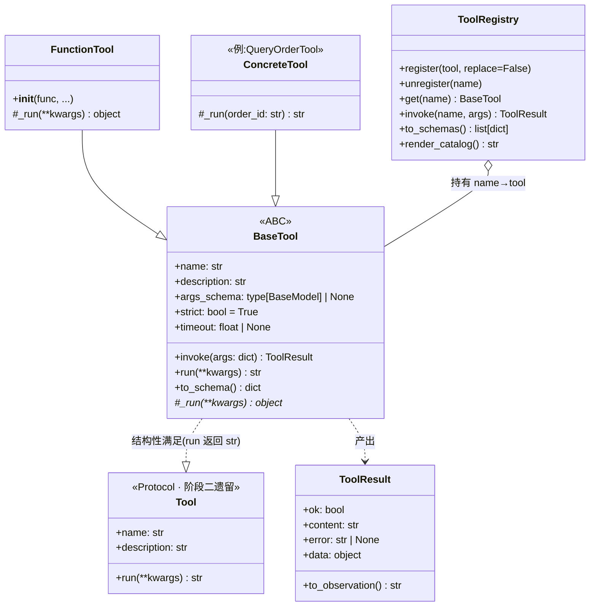

# 阶段三设计文档 · Tool Use 系统

> 对应大纲「阶段三:Tool Use 系统」。先设计 → 评审 → 再编码。
> 本阶段把阶段二的「极简 `Tool` 协议 + 裸调用」升级为完整的工具子系统:
> `BaseTool` 抽象 + Pydantic 参数校验(含 **strict mode**)+ `ToolRegistry` 注册中心 + 标准化执行管线。

---

## 1. 目标与范围

**目标**:设计一个**可扩展的 Tool 抽象层**——工具的定义、注册、发现、校验、执行、错误处理
全部标准化;加一个新工具 = 写一个新类(或用 `@tool` 装饰一个函数),核心循环一行不改。

本阶段分三个子阶段推进(P-A 先行,P-B / P-C 在 P-A 评审通过后做):

**P-A 基础框架(本文档主体,先做)**
- `BaseTool` 抽象基类:Pydantic `args_schema` 参数校验 + **strict mode** + 超时控制 + 统一错误处理
- `ToolResult`:执行结果的标准化返回(成功/失败都不抛异常,喂回模型)
- `ToolRegistry`:注册、发现、按名调用、批量导出 JSON Schema
- `@tool` 装饰器(借鉴 LangChain):普通函数一行变工具,Schema 从类型注解自动推断
- 关键路径单元测试(离线,不花钱)

**P-B 原生 Function Calling(P-A 之后)**
- `LLM` 接口扩展:`chat(messages, tools=...)`,返回结构化 `tool_calls`
- Claude(`tool_use` block)与 OpenAI(`tool_calls` + `strict: true`)两个 provider 的适配
- Agent 支持两种模式:文本 JSON 解析(阶段二方式,兜底)/ 原生 Function Calling(优先)
- 并行工具调用(模型一步返回多个 tool call)

**P-C 具体工具(≥5 个,和导师一起逐个加)**
- 见 §8 工具清单规划;每个工具:完整 Schema + 正常/异常单测

**范围外(明确留给后续阶段)**
- MCP 适配器:作为 `BaseTool` 的一种实现随时可接入(见 §9),但**不在大纲要求内**,本阶段不做
- 长期记忆 / RAG 检索工具的向量部分 → 阶段四
- 工具级权限分层 + HITL 审批 → 阶段六(safety),但 §8 的工具清单已按权限标注,提前留好口子
- 重试 / 降级 / 幂等 → 阶段六

---

## 2. 交付物清单(逐条对照大纲「阶段产出」)

| # | 大纲产出 | 交付物 | 落点 | 子阶段 |
|---|---|---|---|---|
| ① | `BaseTool` 抽象类 + `ToolRegistry` 注册中心 | `BaseTool`/`ToolResult`/`@tool` + `ToolRegistry` | `tools/base.py` · `tools/function_tool.py` · `tools/registry.py` | P-A |
| ② | ≥5 个可用 Tool(完整 Schema + 错误处理) | 见 §8 清单 | `tools/*.py` | P-C |
| ③ | Agent 能自主选择并调用合适的 Tool | 原生 Function Calling + Registry 接入 ReAct 循环 | `core/llm.py` · `core/agent.py` | P-B |
| ④ | 单元测试:每个 Tool 正常/异常覆盖 | 框架层测试(P-A)+ 每工具测试(P-C) | `tests/test_tools.py` 等 | P-A/P-C |
| ⑤ | 设计文档:类图和扩展指南 | 本文档(§4 类图 + §10 扩展指南) | `docs/stage-3-design.md` | P-A |

---

## 3. 借鉴 LangChain 的设计(借什么、不借什么)

| LangChain 的设计 | 我们的取舍 |
|---|---|
| `BaseTool`:`name` + `description` + `args_schema`(Pydantic)+ 子类实现 `_run` | **照搬思想**:公开 `invoke()` 走标准管线(校验→执行→标准化),子类只写业务 `_run()` |
| `@tool` 装饰器:函数 → 工具,Schema 从签名推断 | **照搬思想**:降低写工具的成本,鼓励"多写小工具" |
| `ToolException`:工具错误不炸循环,转成给模型的消息 | **照搬思想**:`ToolResult(ok=False, error=...)`,永不向循环抛异常 |
| `handle_validation_error` 等一堆可配置开关 | **不借**:配置面收敛为 `strict` / `timeout` 两个,够用为止 |
| 异步 `_arun`、回调管理器、streaming events | **不借**(本项目同步够用;异步留到阶段六生产化再议) |
| 无内置全局 Registry(靠 list 传递) | **补强**:大纲明确要求 `ToolRegistry`,我们做成显式注册中心 |

## 4. 类图



关键关系:**`BaseTool.run()` 仍满足阶段二的 `Tool` 协议**(返回 str),所以新工具可以
直接插进现有 `ReActAgent`,循环一行不用改;P-B 的 Function Calling Agent 则改用
结构化的 `invoke()` → `ToolResult`。

---

## 5. 核心设计一:`BaseTool` 与执行管线

子类只需要声明 4 样东西 + 实现 1 个方法:

```python
class QueryOrderTool(BaseTool):
    name = "query_order"
    description = "查订单状态与物流单号。何时用:用户询问订单进度/状态/是否发货时。"
    args_schema = QueryOrderArgs        # Pydantic 模型,自动生成 JSON Schema
    timeout = 5.0                       # 可选;None = 不限时

    def _run(self, order_id: str) -> str:   # 只写业务逻辑,校验/兜错都在基类
        ...
```

公开入口 `invoke(args)` 走固定管线,**任何一步失败都不抛异常**,而是折叠成
`ToolResult(ok=False, error=...)` 让模型看到、自我纠正(与阶段二错误恢复一脉相承):

```
invoke(args)
  ├─ ① 参数校验  args_schema.model_validate(args, strict=self.strict)
  │       失败 → ToolResult(ok=False, error="参数校验失败:...")
  ├─ ② 限时执行  _run(**validated)   (timeout 秒内;超时 → ok=False)
  │       异常 → ToolResult(ok=False, error="TypeError: ...")
  └─ ③ 结果标准化  str 原样 / 其它 json.dumps → ToolResult(ok=True, content=...)
```

### 5.1 strict mode(硬性要求)

`strict: bool = True`(**默认开启**),同时管两件事:

| | strict=True(默认) | strict=False |
|---|---|---|
| 类型 | 精确匹配:`"5"` 传给 `int` 参数 → **报错**(Pydantic strict 校验,禁止跨类型强转) | 宽松:`"5"` 自动转成 `5` |
| 多余参数 | 模型编造的未知参数 → **报错**并列出合法参数名 | 静默忽略 |
| 导出 Schema | `additionalProperties: false` 写进 JSON Schema,提示模型别编参数 | 不加 |

为什么默认 strict:工具参数全部来自**模型生成的 JSON**,宽松强转会掩盖模型的幻觉
(比如把订单号编成数字、多传一个不存在的参数)。strict 下错误**立刻、清晰地**暴露并喂回,
模型下一步自我纠正——这比静默容错更利于调试和评估。P-B 接 OpenAI 时,`strict=True`
还会映射到其 Function Calling 的 `"strict": true`(服务端保证输出严格符合 Schema)。

### 5.2 超时控制

`timeout: float | None`;实现用 `ThreadPoolExecutor` 包一层 `future.result(timeout=...)`。
已知局限(写进 docstring):Python 线程无法被强杀,超时后工作线程可能仍在后台跑完;
对 mock/本地工具无影响,P-C 接真实 IO 时再评估。这是标准库能力内最简单的正确做法。

### 5.3 错误类型

```
ToolError(Exception)                # 工具子系统错误基类
 ├─ ToolValidationError             # ① 参数校验失败
 ├─ ToolTimeoutError                # ② 执行超时
 ├─ ToolRegistrationError           # 注册冲突(重名且未 replace)
 └─ UnknownToolError                # 按名查找不存在
```

注意:这些异常只在**框架内部**与 `registry.get()` 等编程接口上抛;凡是「模型驱动」的路径
(`invoke` / `registry.invoke`)一律折叠成 `ToolResult(ok=False)`,循环永不崩。

### 5.4 Schema 导出(厂商无关)

`to_schema()` 返回中立格式 `{"name", "description", "parameters": <JSON Schema>}`。
**厂商格式转换放在 llm 层**(与阶段一「厂商 SDK 只出现在 llm_claude/llm_openai」同一纪律):

- Claude:`{"name", "description", "input_schema": parameters}`
- OpenAI:`{"type": "function", "function": {"name", "description", "parameters", "strict": true}}`

P-B 实现这两个转换;tools/ 子包对厂商零感知。

---

## 6. 核心设计二:`ToolRegistry`

工具的注册、发现、管理中枢。Agent 不再拿一个 list,而是拿一个 Registry:

```python
registry = ToolRegistry([QueryOrderTool(), QueryLogisticsTool()])
registry.register(CalculatorTool())          # 重名 → ToolRegistrationError(replace=True 可覆盖)
registry.get("query_order")                  # 不存在 → UnknownToolError(附可用工具列表)
registry.invoke("query_order", {"order_id": "12345"})   # 模型驱动入口:永不抛异常
registry.to_schemas()                        # → list[dict],P-B 直接传给 LLM 的 tools 参数
registry.render_catalog()                    # → "- name: description" 文本,给阶段二文本版提示词
```

设计要点:
- 内部就是 `dict[str, BaseTool]`,不搞花活;`__contains__` / `__iter__` / `__len__` 让它像容器
- **重名默认报错**而非静默覆盖——注册冲突是装配 bug,要炸在装配时,不要炸在运行时
- `invoke(name, args)` 是给 Agent 循环用的统一入口:未知工具返回
  `ToolResult(ok=False, error="工具 xxx 不存在。可用工具:[...]")`,与 `BaseTool.invoke` 同构

## 7. 核心设计三:`@tool` 装饰器

大量简单工具(计算器、查时间)写完整类太啰嗦。借鉴 LangChain:

```python
@tool(timeout=3.0)
def calculator(expression: str) -> str:
    """数学计算器。何时用:需要精确计算金额、差价、折扣时。参数 expression 是算式字符串。"""
    ...
```

- `name` ← 函数名;`description` ← docstring(**没有 docstring 直接报错**——工具描述决定模型会不会用对它,不许省)
- `args_schema` ← 用 `pydantic.create_model` 从**类型注解**推断(参数没有注解 → 报错,类型即文档)
- 参数描述可用 `Annotated[str, Field(description="...")]` 补充
- 产物是 `FunctionTool(BaseTool)` 实例,与手写类完全同构,照常进 Registry

---

## 8. 工具清单规划(P-C 逐个实现;「何时用」即 description 的核心)

结合大纲建议(WebSearch/CodeExecutor/File/Http/Calculator)与京东客服场景,规划 8 个、
分两组;**权限层级**提前标注,阶段六 safety 直接复用:

**A 组 · 业务工具(JD mock,后接真 API 零改动)**

| 工具 | 何时用 | 权限 |
|---|---|---|
| `query_order` | 用户问订单进度/状态/是否发货(mock 升级为带 Schema 版) | 低:直接执行 |
| `query_logistics` | 已有运单号,查包裹位置/预计送达(同上升级) | 低:直接执行 |
| `query_product` | 用户问商品价格/库存/参数/保修政策 | 低:直接执行 |
| `search_faq` | 用户问平台规则类问题(退换货政策、发票、优惠券用法) | 低:直接执行 |
| `apply_refund` | 用户明确要求退款/退货,且已确认订单号与理由 | **高:阶段六接 HITL 审批** |

**B 组 · 通用工具(对齐大纲示例)**

| 工具 | 何时用 | 权限 |
|---|---|---|
| `calculator` | 需要精确算金额:差价、折扣、退款分摊(LLM 心算不可靠) | 低 |
| `current_time` | 需要"今天/现在"才能答:预计送达还有几天、是否超退货期 | 低 |
| `http_request` | 需要调外部 HTTP API 取数(演示通用性;白名单限制域名) | 中 |

> ≥5 的达标线:A 组 5 个 + B 组任选,总量 8 个,超出大纲要求;若时间紧,优先保 A 组 + calculator。

---

## 9. 关于 MCP(回答:本阶段用不用?)

**不用,也不需要。** MCP(Model Context Protocol)解决的是「工具由**外部进程/服务器**提供,
如何标准化接入」;大纲阶段三要求的是**自建进程内工具系统**,两者不冲突但层次不同。
本设计天然给 MCP 留了口子:未来写一个 `MCPTool(BaseTool)` 适配器,把 MCP server 暴露的每个
工具包成一个 `BaseTool` 注册进 Registry 即可——核心循环、Registry、Schema 导出全部不动。
这正是「可扩展性」验收的一个好例证,可作为答辩时的加分讨论点,但不占用本阶段工期。

## 10. 扩展指南(如何加一个新工具)

1. **简单工具**:写一个带类型注解 + docstring 的函数,加 `@tool` → 完成
2. **复杂工具**:定义 Pydantic 参数模型 → 继承 `BaseTool`,声明 `name/description/args_schema`
   (可选 `timeout`/`strict`)→ 实现 `_run()`,只写业务逻辑,**不要**自己 try/except 包一层
3. 注册:`registry.register(MyTool())`;重名会在装配时报错
4. description 写法(直接决定模型用不用得对):一句话功能 + **何时用** + 参数含义;参考 §8
5. 测试:正常路径 1 条 + 异常路径(参数错/业务查无)≥1 条,进 `tests/test_tools.py` 同款风格

## 11. 测试计划(P-A,全部离线)

| 覆盖点 | 用例 |
|---|---|
| 校验-正常 | 合法参数 → `ok=True`,content 正确 |
| 校验-strict | 缺必填 / 类型不符(`"5"`→int)/ 多余参数 → `ok=False`,error 可读 |
| 校验-宽松 | `strict=False` 时 `"5"`→5 强转成功、多余参数忽略 |
| 执行-异常 | `_run` 抛任意异常 → `ok=False`,不外泄异常 |
| 执行-超时 | `timeout=0.1` + 慢 `_run` → `ok=False`,error 提示超时 |
| Schema | `to_schema()` 含 name/description/parameters;strict 时 `additionalProperties: false` |
| Registry | 注册/重名报错/replace 覆盖/get 未知报错/invoke 未知返回 ok=False/批量导出 |
| 装饰器 | Schema 推断正确;无注解/无 docstring 报错;执行结果同手写类 |
| 兼容 | `BaseTool` 实例通过阶段二 `Tool` 协议检查,可直接插入现有 `ReActAgent` |
