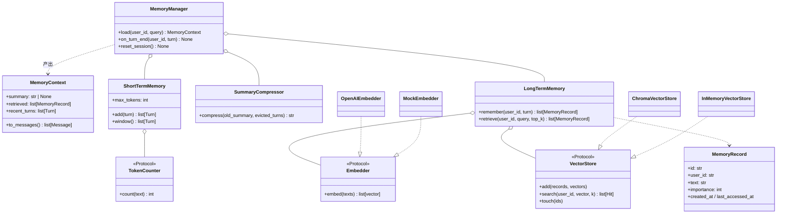

# 阶段四设计文档 · Memory 与上下文管理

> 对应大纲「阶段四:Memory 与上下文管理」。先设计 → 评审 → 再编码。
> 本阶段给 Agent 装上记忆:**短期记忆(滑动窗口 + Token 预算)+ 长期记忆(embedding +
> 向量库 + 三因子检索)+ 上下文压缩(递归摘要)**,由 `MemoryManager` 统一收口,
> 并支持**多用户隔离**(user_id)与**跨会话持久化**。

---

## 1. 目标与范围

**目标**:Agent 能记住历史对话中的关键信息并跨会话引用;上下文永不超预算;
一切可变的部分(embedding 提供方、向量库、压缩策略、打分权重)都在接口/配置后面,可替换。

本阶段分三个子阶段推进(与阶段三同款节奏:每步「实现 → 测试全绿 → commit」):

**P-A 短期记忆 + 压缩(不依赖任何新外部服务,先做)**
- `Turn` 轮数据结构 + `ShortTermMemory`:滑动窗口 + Token 预算,**以轮为原子单位**裁剪
- `TokenCounter` 接口 + 启发式默认实现(不引入厂商 tokenizer 依赖)
- `SummaryCompressor`:被挤出窗口的旧轮 → 递归合并进「前情提要」摘要(用 LLM,测试用 MockLLM)

**P-B 长期记忆(embedding + Chroma + 三因子)**
- `Embedder` 接口 + `OpenAIEmbedder`(text-embedding-3-small)+ `MockEmbedder`(测试,确定性假向量)
- `VectorStore` 接口 + `ChromaVectorStore`(持久化,跨会话)+ `InMemoryVectorStore`(测试,零依赖)
- `MemoryRecord` + 写入策略(**LLM 提炼事实**,评审拍板)+ **三因子检索打分**(相关性/时近性/重要性)
- **增删改:Mem0 式 LLM 写入决策**(ADD/UPDATE/DELETE/NOOP,评审拍板)+ `/forget`、`delete_user` 手动通道
- **user_id 多用户隔离**:检索强制过滤,框架注入、不进 prompt

**P-C 集成 + Demo + 评测**
- `MemoryManager` 统一门面,接入对话流程(核心 Agent 循环零改动)
- `examples/memory_cli.py`:`/user` 切换身份演示隔离、跨会话记忆演示、`/memories` 看检索命中
- **检索准确率对比评测**(大纲产出⑥):纯相关性 vs 三因子 vs 无长期记忆,出报告

**范围外(明确留给后续阶段或记为已知局限)**
- RAG 知识库(商品手册/政策全文检索):与「对话记忆」不同的物种,阶段六业务落地时若需要再加,接口同构
- 异步写入、记忆的分页调度(MemGPT 的 OS 式换页):对照阅读讨论,不实现

---

## 2. 交付物清单(逐条对照大纲「阶段产出」)

| # | 大纲产出 | 交付物 | 落点 | 子阶段 |
|---|---|---|---|---|
| ① | `MemoryManager` 统一管理短期/长期 | `MemoryManager`(load/on_turn_end 两个入口) | `memory/manager.py` | P-C |
| ② | 短期记忆:滑动窗口 + Token 预算 | `ShortTermMemory` + `TokenCounter` | `memory/short_term.py` | P-A |
| ③ | 长期记忆:向量库存储与检索 | `Embedder`/`VectorStore`/`ChromaVectorStore` + 三因子检索 | `memory/long_term.py` · `memory/embedder.py` | P-B |
| ④ | 上下文压缩:自动摘要 | `SummaryCompressor`(递归摘要,近期原文+早期摘要) | `memory/compressor.py` | P-A |
| ⑤ | Demo:记住关键信息、跨会话引用 | `memory_cli`(/user 隔离 + 重启后仍记得) | `examples/memory_cli.py` | P-C |
| ⑥ | 性能测试:不同策略检索准确率对比 | 评测脚本 + 小型标注集 + 报告 | `evaluation/` · `docs/stage-4-memory-eval.md` | P-C |

---

## 3. 借鉴与对照(本阶段的 comparative reading 对象)

| 来源 | 我们的取舍 |
|---|---|
| **Generative Agents**(斯坦福小镇,论文):检索分 = 相关性 + 时近性 + 重要性,三项归一化后加权 | **照搬思想**:三因子打分是本阶段检索核心;重要性由 LLM 写入时打分(1–10),时近性用指数衰减 |
| **MemGPT**:上下文当内存分页,主上下文 = 系统区 + 工作区,溢出换出到外存 | **借结构不借机制**:我们的「system + 前情摘要 + 检索记忆 + 近期窗口」四段上下文就是简化版分区;换页调度不做 |
| **Mem0**:写入时让 LLM 抽取事实 + 对旧记忆做 add/update/delete 决策,而非存原文 | **两样都借**(评审拍板):「LLM 提炼事实」写入 + 「写入决策」增删改(ADD/UPDATE/DELETE/NOOP),见 §7.4 |
| **LangChain Memory**(ConversationBufferWindow / Summary / VectorStoreRetrieverMemory) | 印证我们的三件套分法;它把每种策略做成独立 Memory 类由用户自己拼,我们用 `MemoryManager` 统一编排——大纲要求统一接口,这是我们的**补强** |
| **Swarm `context_variables`**:运行时注入、对模型隐藏 | **照搬思想**:`user_id` 由框架注入检索过滤,不进 prompt,防「帮我查用户 B」的诱导 |

---

## 4. 类图



关键纪律(与阶段一~三一脉相承):**核心只依赖 Protocol**。`chromadb`、`openai` 的 SDK
只出现在各自实现文件里(延迟导入);换向量库/换 embedding 提供方 = 换实现类,零核心改动。

---

## 5. 核心设计一:短期记忆(`ShortTermMemory`)

### 5.1 以「轮」为原子单位(阶段三留下的硬约束)

阶段三之后,一轮对话内部可能包含 `assistant(tool_calls)` 与 `tool(tool_call_id)` 消息,
它们**成对出现、不可拆散**——若滑动窗口从中间切断,留下没有对应 tool_use 的 tool_result,
Claude 端直接 400。所以窗口的基本单位不是消息,而是:

```python
@dataclass
class Turn:
    user_text: str                      # 用户这轮说了什么
    assistant_text: str                 # 最终回答
    inner_messages: tuple[Message, ...] # 中间的工具往返(可为空;裁剪时整体去留)
    created_at: datetime
```

### 5.2 Token 预算(评审拍板:紧凑档,每轮输入 ~3k tokens)

| 上下文段 | 默认预算 | 说明 |
|---|---|---|
| system prompt | ~500,**永不裁** | 现有客服提示词 |
| 前情摘要 | ≤ **300**(`memory_summary_max_tokens`) | 压缩器输出上限 |
| 检索到的长期记忆 | ~100(`memory_top_k=3`,事实条目很短) | |
| 近期窗口原文 | **2000**(`memory_window_tokens`) | 中文约 5–8 轮客服问答 |

选紧凑档的理由:① 便宜;② **压缩机制在正常 demo 里就会真实触发**——聊十来轮就能看到
前情摘要出现、旧轮被摘走;窗口给太大,答辩演示时压缩像摆设。全部默认值进 `config.py`。

- `TokenCounter` 是 Protocol;默认 `HeuristicTokenCounter`:中日韩字符按 1 字 ≈ 1 token、
  其余按 4 字符 ≈ 1 token 估算。**故意不引入厂商 tokenizer**(tiktoken 只对 OpenAI 准,
  对 Claude 本来就是估),精度换来零依赖 + 厂商无关;将来要精确,换一个实现即可。
- `ShortTermMemory(max_tokens, counter)`:`add(turn)` 后若窗口总 token 超预算,
  从**最旧的轮**开始整轮弹出,弹出的轮返回给调用方(交给压缩器,信息不丢)。

### 5.3 消息优先级(对应大纲 4.1「消息优先级排序」)

上下文四段的保留优先级,预算紧张时**从低到高牺牲**:

```
system prompt(永不裁) > 前情摘要 > 检索到的长期记忆(可减 top_k) > 近期窗口(整轮弹出→进摘要)
```

## 6. 核心设计二:上下文压缩(`SummaryCompressor`)

大纲 4.3 的「混合策略:近期保留原文 + 早期使用摘要」+「渐进式摘要」:

```
新摘要 = LLM("请把<旧摘要>与<刚被挤出窗口的轮>合并为一段客服前情提要,
             保留:用户身份信息、订单号、已承诺事项、未解决问题", max 300 tokens)
```

- **递归**:每次只摘「旧摘要 + 新弹出的轮」,不重摘全史,成本 O(1)
- 摘要注入位置:作为 system prompt 的附加段(「前情提要:…」),不占对话消息
- 用注入的 `LLM` 接口(与主循环同一个抽象),测试用 MockLLM 零成本;
  LLM 调用失败时降级:旧摘要保持不变 + 弹出轮做「截断拼接」兜底,**压缩失败不能炸对话**

## 7. 核心设计三:长期记忆(`LongTermMemory`)

### 7.1 写入:LLM 提炼事实(评审拍板,提炼策略 2026-07-07 敲定)

每轮结束(`on_turn_end`)用一次独立 LLM 调用(同一个便宜模型)从这轮对话抽取
「值得跨会话记住的事实」,可能为空:

```json
[{"fact": "用户的常用收货地址在上海浦东", "importance": 8},
 {"fact": "用户对订单 12345 的物流速度不满", "importance": 6}]
```

**提炼 prompt 的四条规则(写死进 prompt,答辩可讲)**:

1. **记什么**:用户身份/偏好/常用地址、对某订单/商品的诉求与情绪、我们做出的承诺、未解决的问题
2. **不记什么**:闲聊寒暄;**工具随时能查到的易变状态**——记「用户关心订单 12345 的进度」,
   不记「订单 12345 已发货」(后者下周就错,还会和工具实时结果打架)
3. **重要性评分标准**:1–3 琐事 / 4–7 偏好与一般事实 / 8–10 身份地址、投诉、承诺
4. **产出约束**:严格 JSON;**每轮最多 3 条**(防灌库);没有值得记的返回 `[]`

一次调用同时解决「存什么」和「重要性打分」;JSON 解析失败则**这轮不写入**
(宁缺勿滥,不炸流程)。写入前的去重/更新交给 §7.4 的写入决策。

### 7.2 存储:`ChromaVectorStore`(评审拍板选 Chroma)

- Chroma `PersistentClient`,数据落 `data/memory/`(**gitignore**)→ 天然满足「跨会话引用」
- 每条记录:文本 + 向量 + metadata(`user_id` / `importance` / `created_at` / `last_accessed_at`)
- 检索用 Chroma 的 metadata filter 做 **user_id 强制过滤**(隔离在存储层,不靠上层自觉)
- 接口后面另备 `InMemoryVectorStore`(纯 Python 余弦),测试零依赖、也是「可替换」的活证明

### 7.3 检索:三因子打分(Generative Agents 公式)

Chroma 先按余弦召回 `top_k × 4` 个候选(已过滤 user_id),再在框架层重排:

```
score = w_rel · relevance + w_rec · recency + w_imp · importance
  relevance  = 余弦相似度(归一化到 0~1)
  recency    = 0.5 ^ (距上次访问小时数 / half_life_hours)   # 半衰期可配,默认 24h
  importance = 写入时 LLM 打的 1~10 分 / 10
```

- **默认权重(评审拍板):`w_rel=1.0, w_rec=0.5, w_imp=0.5`——相关性主导**,时近性与重要性
  只当加分项/平局裁决,防止「重要性 10 但与当前问题无关」的记忆(如投诉史)挤掉真正相关的记忆。
  与论文原味平权(1.0/1.0/1.0)的差异由评测⑥用 Hit@1/Recall@3 实测对比
- 三个权重 + 半衰期 + top_k 全部进 `config.py`,评测⑥就靠调这组参数对比
- 命中的记忆更新 `last_accessed_at`(被用到的记忆「保鲜」,冷记忆自然衰减——GA 同款)
- 检索结果注入方式:system 附加段「关于该用户的已知信息:…」,**只注入,不指令**,
  由模型自行决定用不用

### 7.4 增删改:Mem0 式写入决策(评审拍板)

光「增」不够——「我地址换了」这类矛盾必须真正改掉旧记忆,不能留两条打架。流程:

```
本轮提炼出新事实(§7.1,可能 0 条,0 条则整段跳过)
  → 每条新事实按向量召回该用户最相似的 3 条旧记忆
  → 一次 LLM 调用,对每条新事实裁决:
       ADD    全新事实,直接入库
       UPDATE 与某条旧记忆是同一件事但内容更新/矛盾 → 新文本覆盖旧条(id 不变,时间刷新)
       DELETE 新信息表明某条旧事实已失效 → 删旧条(且新事实本身不入库,如「问题已解决」)
       NOOP   与旧记忆重复 → 跳过
  → 执行;裁决 JSON 解析失败 → 降级为「全部 ADD + 余弦>0.9 跳过」,不炸流程
```

- 成本:仅在有新事实的轮多**一次**便宜调用(裁决是批量的,不按条计费);闲聊轮零开销
- 手动通道(隔离之外的删除权,客服合规诉求):CLI `/memories` 查看本人记忆、
  `/forget <id>` 删单条;`LongTermMemory.delete_user(user_id)` 一键清空
  (对应「删除我的个人信息」,答辩素材)

### 7.5 多用户隔离(评审拍板:隔离 + CLI 切换演示)

- `user_id` 由**调用方/框架传入**(CLI 里 `/user alice` 切换),不进 prompt、模型不可见、
  不可被对话内容篡改——Swarm `context_variables` 的思想
- **隔离性红线测试**:alice 写入的记忆,以 bob 身份检索必须 0 命中(存储层 filter 保证)

---

## 8. `MemoryManager` 与 Agent 的集成

**原则:核心 Agent 循环零改动。** `ToolCallingAgent` / `ReActAgent` 不感知记忆的存在,
记忆发生在「组装上下文」这一层(与阶段二「外层干净历史」同一位置):

```python
manager = MemoryManager(short_term, long_term, compressor)   # 三件套注入,均可缺省

# 每轮对话(memory_cli 的主循环):
ctx = manager.load(user_id, question)          # ① 检索长期 + 取摘要 + 取窗口 → 组装消息
result = agent.run(question, history=ctx.to_messages())      # ② 跑原有 Agent,一行不改
manager.on_turn_end(user_id, turn)             # ③ 窗口滚动→溢出压缩;LLM 提炼事实→长期库
```

- `to_messages()` 产出顺序:〔前情摘要 + 已知用户信息〕(system 附加段)→ 近期窗口原文轮
- 三件套都可为 `None`(如不配长期记忆就退化为纯滑窗)——组合自由度即「策略可换」
- 为什么不把 memory 塞进 Agent 构造参数:记忆属于**会话**(谁在说话),Agent 属于**能力**
  (会干什么);塞进去会让 Agent 绑死单用户。答辩可讲的边界划分。

## 9. 评测设计(大纲产出⑥:检索准确率对比)

- **小型标注集**(手工构造,~15 个用户事实 × ~20 条查询):每条查询标注「应命中的记忆 id」,
  含时间性陷阱(新旧地址矛盾,应命中新的)和重要性陷阱(闲聊 vs 关键事实)
- **对比策略**:A. 无长期记忆(只滑窗)/ B. 纯相关性(w_rec=w_imp=0)/ C. 三因子(默认权重)
- **指标**:Hit@1、Recall@3;脚本落 `evaluation/`,报告落 `docs/stage-4-memory-eval.md`
- embedding 用真实 API 跑一次(text-embedding-3-small,几百条文本 ≈ 不到 1 分钱),
  单测仍全部用 MockEmbedder 离线

## 10. 配置与依赖变更

- `requirements.txt` + `chromadb>=0.5`(嵌入式,无需服务);OpenAI SDK 已有(embedding 复用)
- `config.py` 新增(全部带默认值):`memory_window_tokens` / `memory_summary_max_tokens` /
  `memory_top_k` / `memory_weights(rel,rec,imp)` / `memory_half_life_hours` /
  `memory_dedup_threshold` / `embedding_model` / `memory_persist_dir`
- `.gitignore` + `data/`

## 11. 测试计划(全部离线:MockLLM + MockEmbedder + InMemoryVectorStore)

| 覆盖点 | 用例 |
|---|---|
| 窗口-预算 | 超预算后最旧轮被弹出;窗口内 token ≤ 预算 |
| 窗口-原子性 | 含工具往返的轮要么整轮在、要么整轮出,tool 消息不落单 |
| 压缩-递归 | 弹出轮进摘要;二次弹出与旧摘要合并;MockLLM 校验收到的合并请求 |
| 压缩-降级 | LLM 抛错 → 摘要不变 + 截断兜底,不抛异常 |
| 提炼-写入 | MockLLM 返回事实 JSON → 入库;返回 `[]`/非法 JSON → 不入库不报错;>3 条被截断 |
| 写入决策-ADD/NOOP | 全新事实入库;重复事实被 NOOP 跳过 |
| 写入决策-UPDATE | 「地址北京→上海」:旧条被覆盖,库里只剩新地址 |
| 写入决策-DELETE | 「问题已解决」:旧的未解决事项被删,新事实不入库 |
| 写入决策-降级 | 裁决 JSON 非法 → 全部 ADD + 余弦>0.9 跳过,不抛异常 |
| 手动删除 | `/forget` 删单条;`delete_user` 后该用户检索 0 命中 |
| 三因子 | 构造三条记忆分别在单一因子上占优,调权重验证排序翻转 |
| 隔离 | alice 的记忆 bob 检索 0 命中(红线) |
| 保鲜 | 命中后 last_accessed_at 更新,recency 得分回升 |
| 集成 | MemoryManager 全链路:多轮对话 → 摘要出现 → 事实可跨"会话"(新 manager 实例同一 store)检索 |
| 缺省组合 | 只配滑窗(无长期/无压缩)也能正常跑 |
